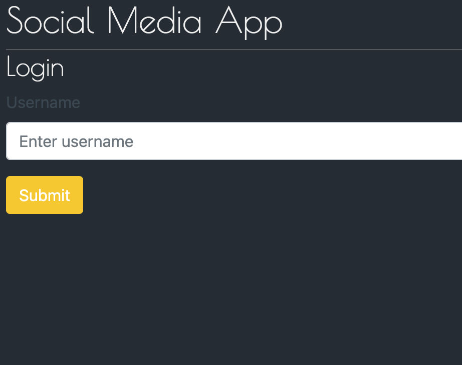
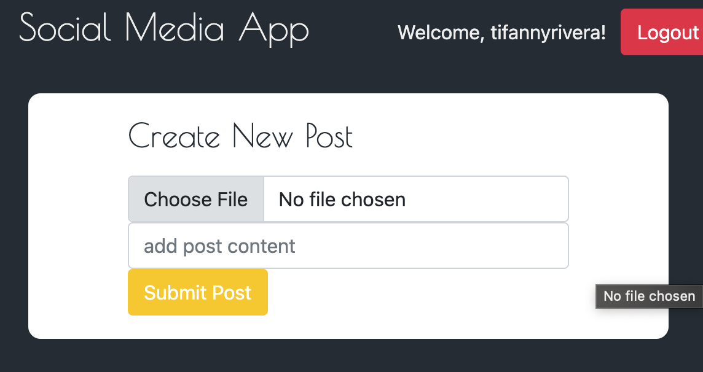
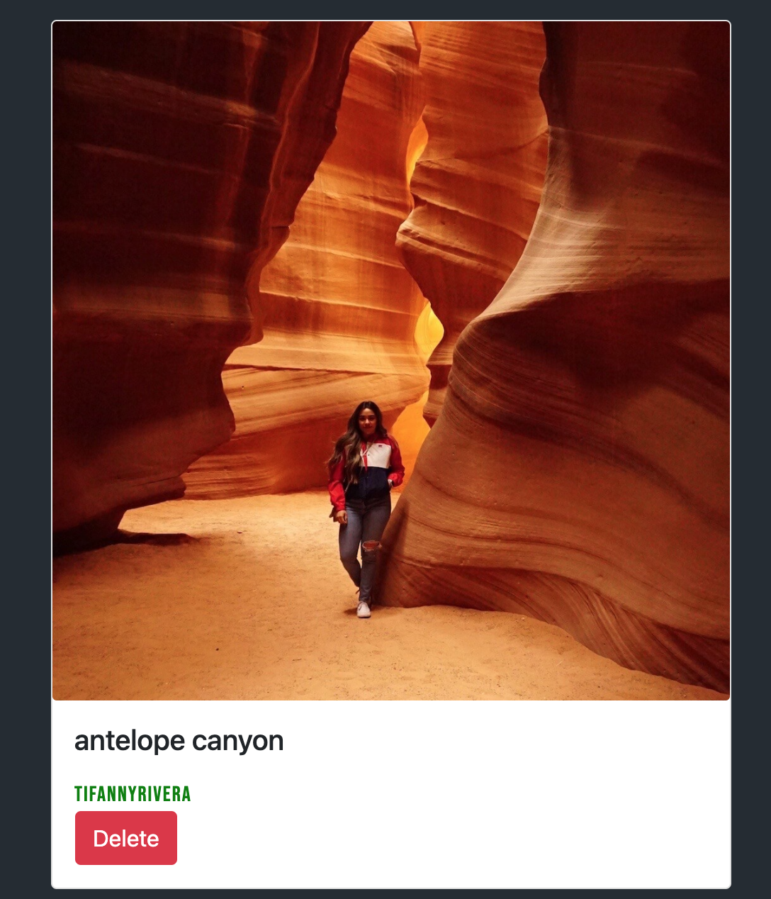

# Social Media App

This is a mock social media application where user can login with their username. User is able to create posts with text or with an image. When the user is signed in they are able to delete their own posts. User has the option to logout.

# Preview 
User is able to create a username and login.

User is able to upload an image as well as add post content.

User's post has the option to delete, only when signed in and will display the username who created the content.

# Link
[Click here to login](https://tr-socialmediaapp.herokuapp.com/)